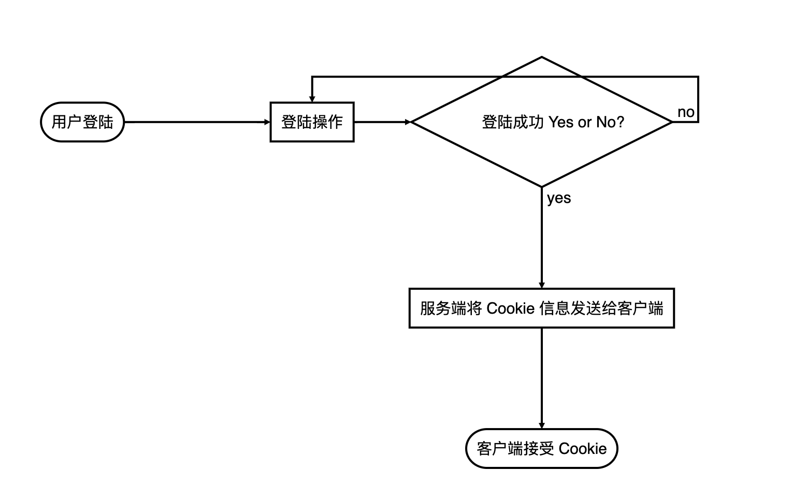

[返回导航页](https://cqzhen.github.io/blog.html "导航页面")

# Cookie

### 为什么会有 Cookie ？

	很简单，如果电话没有号码这个机制了会怎么样？

	你可以幻想下：我刚要给李四打个电话。什么？电话号码这个机制不存在了。那我要怎么打给李四电话？反过来李四怎么打给我电话？随便一个人打电话到我这里冒充李四怎么办（当然，你可以根据聊天识别，咱们就假设没办法识别）？总要有一种机制可以让我们互相打给对方电话。电话号码就是一个机制。

	Cookie 就类似互联网应用里面的电话号码。有了 Cookie，我就可以和互联网应用互动了。而且张三、李四、王五都可以和互联网应用互动了。
	我：嘿，某猫，我买了一尾帽子。我提交了。
	某猫：哦，我看到你提交过来了。
	张三：嘿，某猫，我买了一件衬衫。我提交了。
	某猫：哦，我看到张三你提交过来了。
	.
	.
	.
	我：嘿，某猫，我订单支付过了。
	张三：嘿，某猫，我订单支付过了。
	.
	.
	.
	某猫：哦，我看你和张三都支付过了。

	##### 其实啰嗦这么多，Cookie 主要的作用就是可以让你和应用互动。假如没有 Cookie，应用无法识别你是张三，还是李四，还是王五。甚至都不知道你支付的订单是谁的。

### Cookie 生命历程：出生到消失

	#### Cookie 是怎么生成的？
	1. 当服务器收到HTTP请求时，服务器可以在响应头里面添加一个 Set-Cookie 选项。浏览器收到响应后通常会保存下 Cookie，之后对该服务器每一次请求中都通过 Cookie 请求头部将 Cookie 信息发送给服务器。另外，Cookie 的过期时间、域、路径、有效期、适用站点都可以根据需要来指定。
	比如你请求登陆某猫，某猫验证没问题，就给你返回一些 Cookie（Set-Cookie 字段，这个浏览器会处理）信息。然后你的浏览器接受到某猫的反馈后开始处理反馈（浏览器在这个时候会根据某猫返回的 Set-Cookie 字段处理 Cookie ），之后你就可以基于你的 Cookie 和某猫互动了（因为你的每次互动都会带着你的 Cookie ）。
	2. 本地生成 Cookie，可以通过 document.cookie；
	#### Cookie 是怎么消失的？
	某猫第一次返回给你的 Set-Cookie 字段里面有设置有效时间（Expires 或 Max-Age，Max-Age 优先级最高）。 

### 前端是否可操控 Cookie 以及怎么操控？
	### document.cookie
	### HttpOnly
	这个需要看情况，主要取决与某猫返回的 Set-Cookie 字段里面是否设置了 HttpOnly 字段。如果设置前端就无法操作，没有设置就可以操作。

### 设置 Cookie 的相关字段
	1. <cookie-name>=<cookie-value>，cookie-name：你要设置 Cookie 的名称，cookie-value: 你要设置的值。要特别注意 **_Secure-** 和 **_Host-** 前缀。以 __Secure- 为前缀的 cookie（其中连接符是前缀的一部分），必须与 secure 属性一同设置，同时必须应用于安全页面（即使用 HTTPS 访问的页面）。以 __Host- 为前缀的 cookie，必须与 secure 属性一同设置，必须应用于安全页面（即使用 HTTPS 访问的页面），必须不能设置 domain 属性 （也就不会发送给子域），同时 path 属性的值必须为“/”。
	2. Expires=<date>，cookie 的最长有效时间，形式为符合 HTTP-date 规范的时间戳。如果没有设置这个属性，那么表示这是一个会话期 cookie 。一个会话结束于客户端被关闭时，这意味着会话期 cookie 在彼时会被移除。
	3. Max-Age=<non-zero-digit>，在 cookie 失效之前需要经过的秒数。秒数为 0 或 -1 将会使 cookie 直接过期。假如二者 （指 Expires 和Max-Age） 均存在，那么 Max-Age 优先级更高。
	4. Domain=<domain-value>，指定 cookie 可以送达的主机名。假如没有指定，那么默认值为当前文档访问地址中的主机部分（但是不包含子域名）。与之前的规范不同的是，域名之前的点号会被忽略。假如指定了域名，那么相当于各个子域名也包含在内了。
	5. Path=<path-value>，指定一个 URL 路径，这个路径必须出现在要请求的资源的路径中才可以发送 Cookie 首部。如果 path=/docs，那么 "/docs", "/docs/Web/" 或者 "/docs/Web/HTTP" 都满足匹配的条件）。
	6. Secure，一个带有安全属性的 cookie 只有在请求使用SSL和HTTPS协议的时候才会被发送到服务器。然而，保密或敏感信息永远不要在 HTTP cookie 中存储或传输，因为整个机制从本质上来说都是不安全的，比如前述协议并不意味着所有的信息都是经过加密的。**非安全站点（http:）已经不能再在 cookie 中设置 secure 指令了（在Chrome 52+ and Firefox 52+ 中新引入的限制）。**
	7. HttpOnly，设置了 HttpOnly 属性的 cookie 不能使用 JavaScript 经由  Document.cookie 属性、XMLHttpRequest 和  Request APIs 进行访问，以防范跨站脚本攻击（XSS）。
	8. SameSite=Strict || Lax，允许服务器设定一则 cookie 不随着跨域请求一起发送，这样可以在一定程度上防范跨站请求伪造攻击（CSRF）。**这个字段还在实验阶段**

	会话期 cookie：会话期 cookies 将会在客户端关闭时被移除。 会话期 cookie 不设置 Expires 或 Max-Age 指令。注意浏览器通常支持会话恢复功能。
	Set-Cookie: sessionid=38afes7a8; HttpOnly; Path=/

	持久化 cookie：持久化 Cookie 不会在客户端关闭时失效，而是在特定的日期（Expires）或者经过一段特定的时间之后（Max-Age）才会失效。
	Set-Cookie: id=a3fWa; Expires=Fri Nov 08 2019 01:53:30 GMT; Secure; HttpOnly

	非法域：属于特定域的 cookie，假如域名不能涵盖原始服务器的域名，那么应该被用户代理拒绝。下面这个 cookie 假如是被域名为 originalcompany.com 的服务器设置的，那么将会遭到用户代理的拒绝。
	Set-Cookie: qwerty=219ffwef9w0f; Domain=somecompany.co.uk; Path=/; Expires=Fri Nov 08 2019 01:53:30 GMT

### 绘制流程图 

### Session、Cookie、Token 的区别
